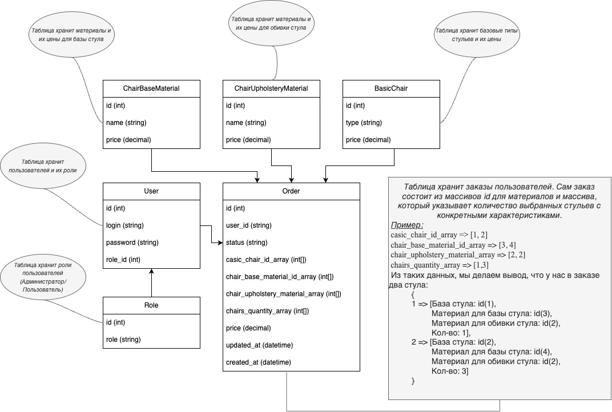

# Тестовое задание

# Содержание
- [Задача](#задача)
- [Архитектура БД](#архитектура-бд)
- [Запуск](#запуск)
- [Тесты](#тесты)
- [Вопросы по архитектуре](#вопросы-по-архитектуре)

# Задача
Необходимо разработать прототип внутреннего приложения для фабрики стульев, необходимый функционал:
- заказ стульев:
  1. Возможность выбора материала для основы стула и материала обивки
  2. Количества стульев
     При составлении заказа должна считаться стоимость заказа, (базовая цена стула + цена
     материала основы + цена материала обивки) * количество
- возможность просмотра заказов с фильтрацией по статусам
- добавление, удаление, редактирование материалов
  
# Архитектура БД


# Запуск
Первым делом запускаем docker (там лежит наша БД):
```
$ /usr/local/bin/docker-compose -f /Users/tv/Desktop/chair_factory/compose.yaml -p chair_factory up -d
```

Сделаем миграцию:
```
$ ./bin/console doctrine:migrations:migrate
```

Затем подгрузим наши сущности (`fixtures`) в БД:
```
$ ./bin/console doctrine:fixtures:load --purge-with-truncate
```
И наконец, запустим наш `Symfony` сервер:
```
$ symfony serve
```
Перейдём по адресу [`https://127.0.0.1:8000/api/doc`](https://127.0.0.1:8000/api/doc`) и увидим нашу документацию к API.

# Тесты
Запуск тестов:
```
$ ./bin/phpunit
```
> Данный проект содержит несколько unit-тестов (`/tests/Service/`) и несколько функциональных тестов (`/tests/Controller/`). \
> !!! В unit-тестах есть захардкоженные id'шники.

# Вопросы по архитектуре

Напишу ответы на вопросы, которые могут возникнуть в процессе просмотра кода:
- Почему мы создаём классы `*ArrayResponse` для ответов, которые состоят из массива $items?
Почему бы просто не возвращать `*ArrayItem`?

> Если мы отдаём массив с моделями, то проблема в том, что он не может расширяться.
> Если нам понадобиться добавить к ответу какое-то поле, кроме массива (Общие настройки, пагинация и тд),
> то мы этого не сможем сдлеать. \
> Объект является расширяемой структурой, а с массивом ответ изменить не получиться.

- Зависимости в проекте: `Controller` -> `Service` -> `Repository`. (Контроллер зависит от сервиса, сервис зависит от репозитория.)
SOLID подразумевает, что наши зависимости зависят от абстракций, а мы зависим от конкретной реализации.
Не стоит ли на каждую зависимость использовать интерфес, чтобы зависить от него?

> С теоритической точки зрения это безусловно правильно, но с практической точки зрения, когда мы пишем именно приложение, а не библиотеку
> у нас появляеться много лишних интерфейсов. Вряд-ли у нашего сервиса будет более, чем одна реализация. Если потребуется внести какие-то изменения,
> то мы сможем внести без проблем изменения в нашу единственную реализацию. Поэтому в данном случае, я отдаю предпочтение практичности.


- Если мы посмотрим на контроллер, то увидим, что отдаём ответ сервиса на прямую.
Слой представления не разделен от сервисного слоя. Почему нет чётких разделений на слои?

> С практической точки зрения, в нашем приложении нет пользы от этого,
> потому что то что мы отдаём из сервиса, всегда будет отдаваться клиенту.
> Поэтому вместо того, чтобы на каждую модель сервиса делать идентичную модель для представления,
> мы отдаём её сразу в слой представления.
> Тут мы жертвуем чётким разделением слоёв, но зато приобретаем более практическую ценность,
> потому что мы не будем делать копию каждого класса и не будем постоянно перемапливать.


- Многие считают, что если в проекте есть папка `Service`, то это считается плохим тоном,
потому что все классы надо разбивать по доменам. Почему нет подхода DDD?

> Я посчитал, что в нашем случае мы можем обойтись без этого подхода, потому что с ним было бы всё намного сложнее.
> Я просто классифицирую классы по их назначению. Это не являеться плохим тоно, просто один из подходов к разработке.
